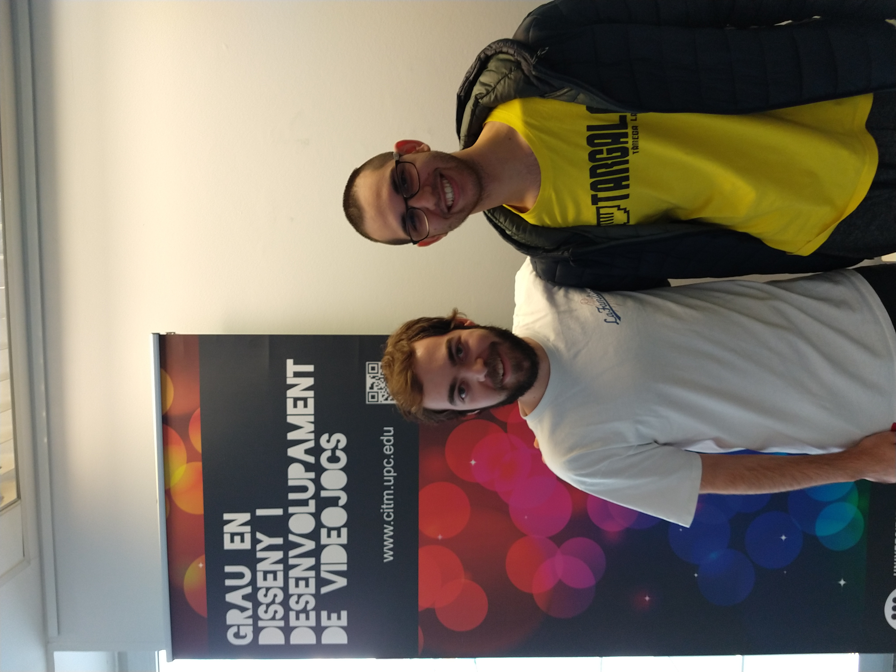

# **Our Project**

Game for the videogame development subject. Our goal is to make a platformer with two levels made in Tiled with the player as a character moving and climbing on the levels while the player is able to save and load the game. With all of this there is enemies pathfinding implemented along with animations at a stable frame rate of 30fps, all movement is normalized and a structured entity system documented in an UML. Also added a menu and HUD that are implemented in a structured UI system documented in other UML.

## **The game**
A platformer where you are a caveman armed with a mace, on you have to catch as much food as possible while batting against bats and T-rexs before you end the levels.

## **Team**

_Gutiérrez LLenas, Ricardo’s work and Github_
* Pathfinding, normalized logic, entity system, camera culling and UI functionability.
* [Github account](https://github.com/Ricardogll)

_Gómez Roldán, Sergio’s work and Github_
* Sprites, audio, entities wander, UI interaction and some modules of code.
* [Github account](https://github.com/Sersius)

## **Main Core subsystems**
The game code is structured in modules. The module j1App.cpp manages all the other modules calling in loop its respective awake, preupdate, update, postupdate, cleanup that they share through a base class j1Module.cpp.

For entities we have implemented a respective factory system along with UI that manages all that happen in the UI independently to everything.

All animations, paths and levels are read through a xml file to improve the readability of the code and at the same time to do the changes while testing more fast.

### **Innovations**
* Camera culling, only printing what the camera sees at the moment.

* Volume changing mid-game with keypad plus and minus.

* Entities wander, if they are not following you, start moving around.

## **How to play**
You have to catch as much food as possible for more score, you get socre beating enemies and collecting chicken. You have 3 lifes, if you run out of lifes the main menu will pop up, for the game controls check down down below. Hope you enjoy!

### **Controls**
~~~~~~~~~~~~~~~
Player controls:
- Left  (A)
- Right (D)
- Jump  (Espace)
- Attack (C)
- Climb (W,A,S,D). Press W when you are on top of a climbable part of the map to make the player grab onto it.

- Plus and minus in the keypad to change the volume

- Esc to close the game

Debug Controls:
- F1:  Start at the very first level
- F2:  Start at the second map
- F5:  Save the current state
- F6:  Load the previous state
- F8:  UI debug mode
- F9:  Draw colliders and enemies pathfinding
- F10: God Mode
- F11: Cap or uncap FPS. (Capped fps equals 30fps)
- F3: To see camera culling in work with 1 less tile

*Note: You won't be able to save or load while the game is changing scenes or jumping to avoid errors.*
~~~~~~~~~~~~~~~

## **Important links**

> ### Check the Github repositiry [here.](https://github.com/Ricardogll/Prehistoric-Journey)
> ### Download the latest version of the game [here.]()

### Disclosure

We do not own any of the art, music or fx. Authors credited below

- Art and music: by PixelBoy https://www.gamedevmarket.net/member/Pixelboy

- Fx:  https://freesound.org

## License

MIT License

Copyright (c) 2018 

Permission is hereby granted, free of charge, to any person obtaining a copy
of this software and associated documentation files (the "Software"), to deal
in the Software without restriction, including without limitation the rights
to use, copy, modify, merge, publish, distribute, sublicense, and/or sell
copies of the Software, and to permit persons to whom the Software is
furnished to do so, subject to the following conditions:

The above copyright notice and this permission notice shall be included in all
copies or substantial portions of the Software.

THE SOFTWARE IS PROVIDED "AS IS", WITHOUT WARRANTY OF ANY KIND, EXPRESS OR
IMPLIED, INCLUDING BUT NOT LIMITED TO THE WARRANTIES OF MERCHANTABILITY,
FITNESS FOR A PARTICULAR PURPOSE AND NONINFRINGEMENT. IN NO EVENT SHALL THE
AUTHORS OR COPYRIGHT HOLDERS BE LIABLE FOR ANY CLAIM, DAMAGES OR OTHER
LIABILITY, WHETHER IN AN ACTION OF CONTRACT, TORT OR OTHERWISE, ARISING FROM,
OUT OF OR IN CONNECTION WITH THE SOFTWARE OR THE USE OR OTHER DEALINGS IN THE
SOFTWARE.
